# VulnHub – VulnUni 1.0.1 (Lab Writeup)

Author: SveSec  
Platform: VulnHub (Local VM Lab)  
Scope: Educational penetration testing in a controlled environment.  
Evidence: Screenshots and raw artifacts are provided in the repository.

Repository structure used in this report:

README.md – full walkthrough report  
evidence/screenshots – visual proof of actions performed  
evidence/docs – raw evidence files (requests, sqlmap output, headers, etc.)

All sensitive information such as IP addresses has been masked where appropriate.

------------------------------------------------------------
Overview
------------------------------------------------------------

This repository documents a full penetration testing walkthrough of the VulnHub machine "VulnUni 1.0.1".

The objective of the exercise was to perform a complete attack chain starting from initial reconnaissance and ending with full root access on the target system.

The attack path involved the following stages:

Network discovery  
Service enumeration  
Web application reconnaissance  
SQL Injection exploitation  
Credential extraction  
Administrative access  
Remote Code Execution (RCE)  
Privilege escalation using Dirty COW

------------------------------------------------------------
Network Discovery
------------------------------------------------------------

The first step was identifying the target machine inside the lab network.

An ARP scan was used to detect active hosts.

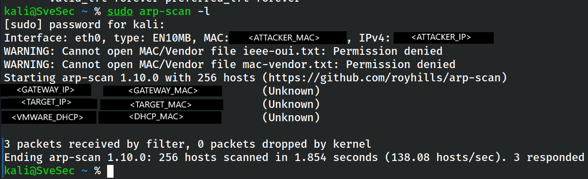

Once the target IP address was identified, a full Nmap scan was performed to determine open services and versions.

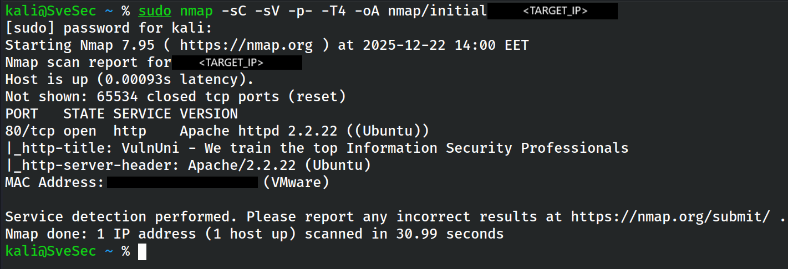

The raw Nmap output used for enumeration can be found here:

evidence/docs/initial_masked.nmap

------------------------------------------------------------
Web Application Reconnaissance
------------------------------------------------------------

Browsing the web server revealed a portal related to an educational platform.

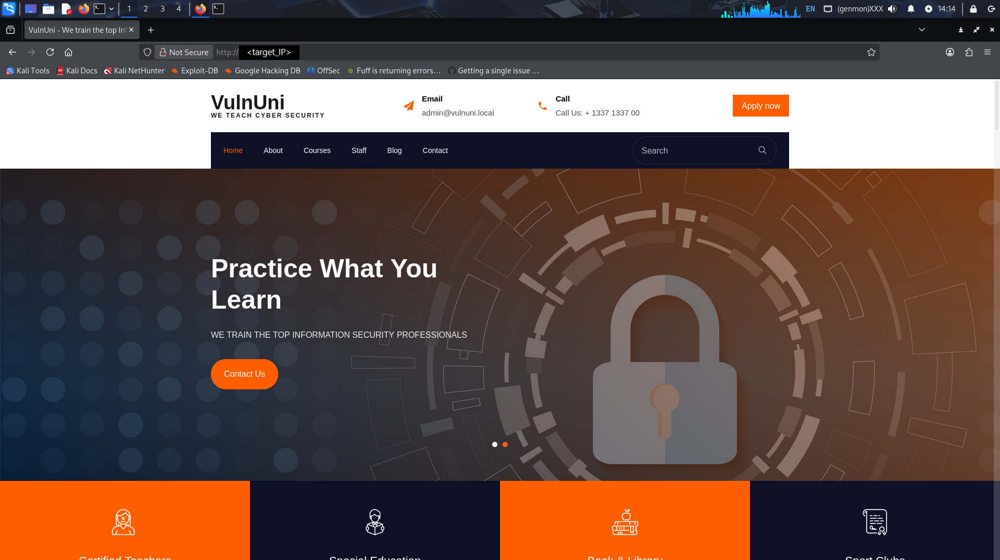

Further exploration revealed hidden course-related paths leading to the eClass system.

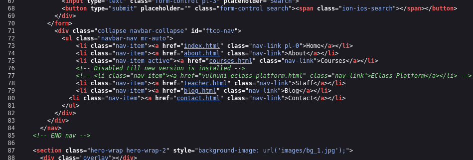

The login functionality of the platform was then analyzed.

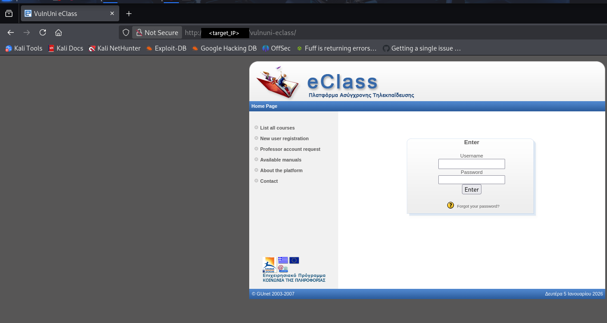

The login form source code was inspected to understand the parameters used during authentication.

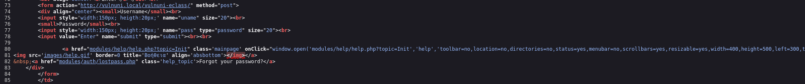

Captured HTTP login requests were analyzed.

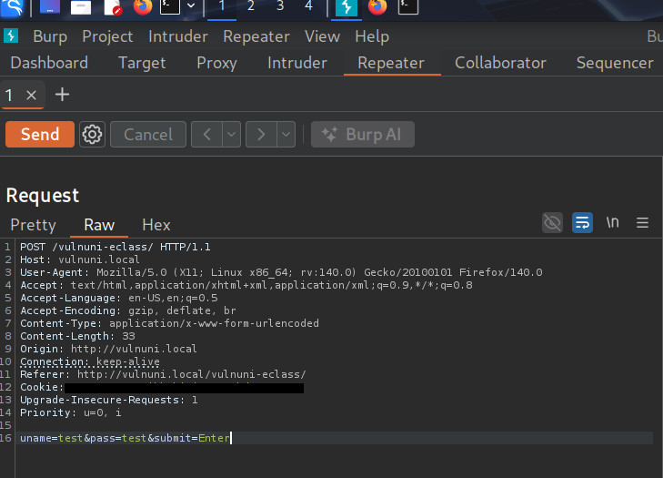

Supporting request artifacts are available:

evidence/docs/00_login_form_source_masked.html  
evidence/docs/03_login_form_uname_pass.html  
evidence/docs/04_login_attempt_test_headers+body_MASKED.txt

------------------------------------------------------------
Application Error Disclosure
------------------------------------------------------------

During testing of different platform forms, error messages revealed backend information.

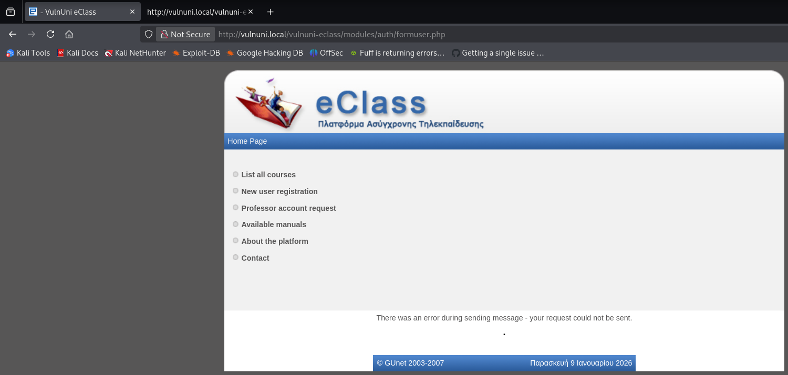

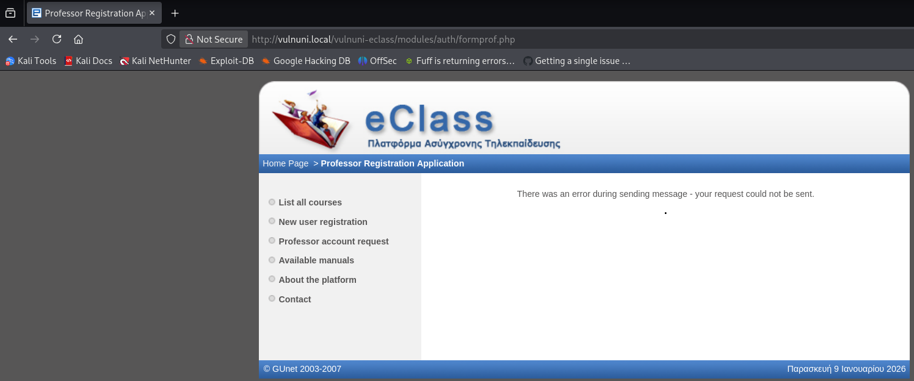

A phpBB database error also appeared, indicating possible SQL interaction vulnerabilities.

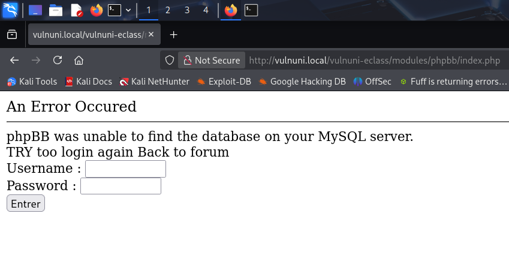

------------------------------------------------------------
Document Module Enumeration
------------------------------------------------------------

The document module was explored and revealed directory listing functionality.

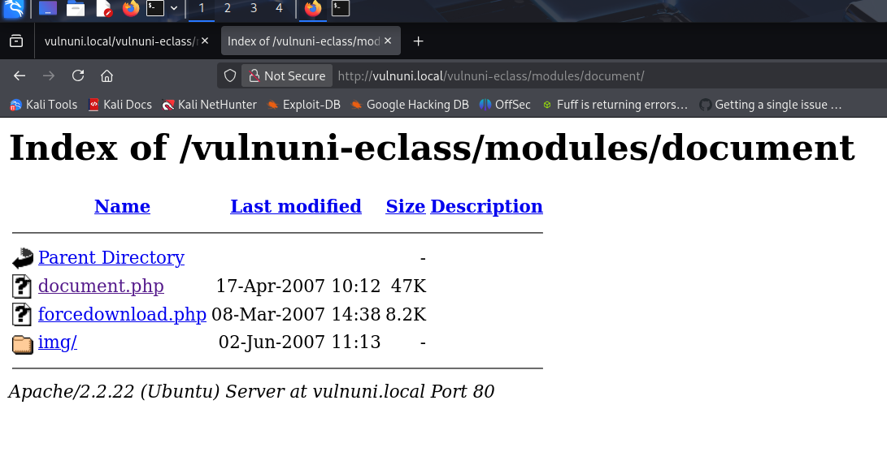

Evidence for the document module enumeration:

evidence/docs/01_documents_listing_masked.html  
evidence/docs/02_chat_file_read_headers_masked.txt

------------------------------------------------------------
SQL Injection Discovery
------------------------------------------------------------

Further testing revealed a SQL Injection vulnerability.

The vulnerability was confirmed using sqlmap.

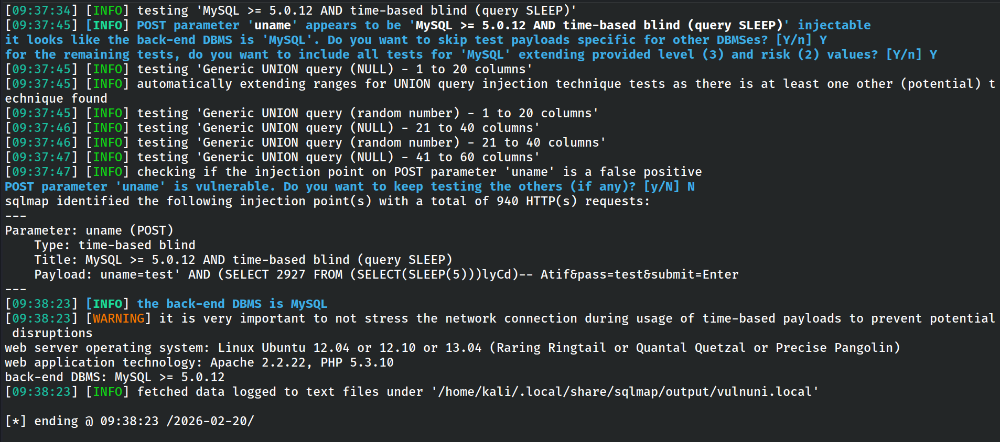

Database enumeration followed.

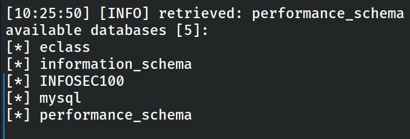

Tables inside the eClass database were then extracted.

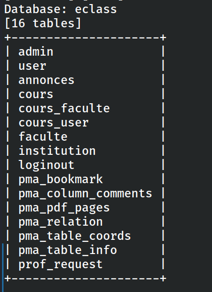

User-related columns were identified.

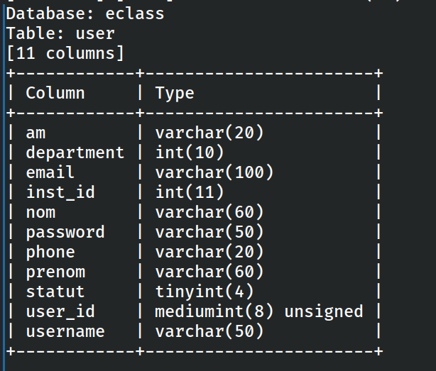

Finally, user credentials were extracted from the database.

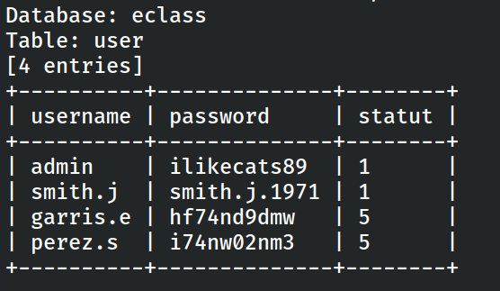

Full sqlmap output is provided here:

evidence/docs/09_sqlmap_sqli_detection.txt  
evidence/docs/10_sqlmap_dbs.txt  
evidence/docs/11_sqlmap_eclass_tables.txt  
evidence/docs/12_sqlmap_user_columns.txt  
evidence/docs/13_sqlmap_user_creds.txt

------------------------------------------------------------
Administrative Access
------------------------------------------------------------

Using the extracted credentials, access to the administrative panel was achieved.

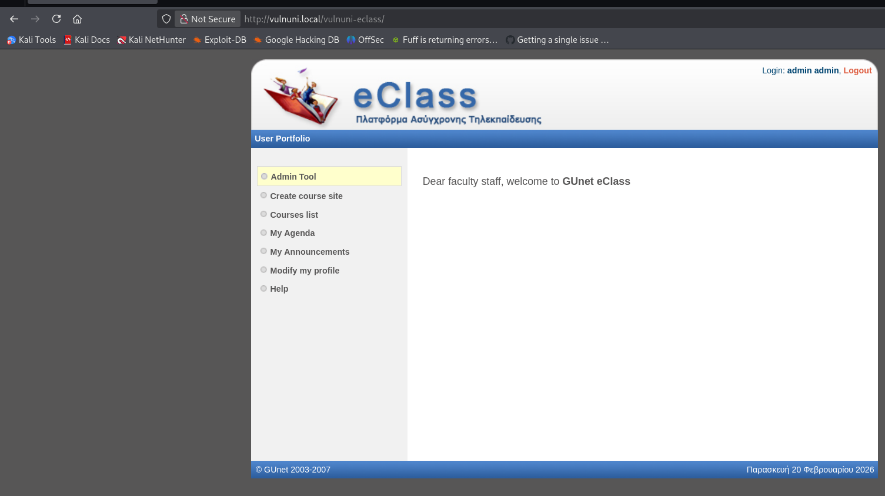

Within the configuration interface, database credentials were exposed.

------------------------------------------------------------
Remote Code Execution
------------------------------------------------------------

Through the application functionality it became possible to upload and restore files, leading to remote code execution.

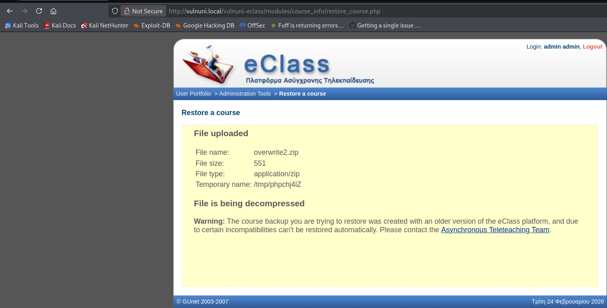

The temporary directory used during the upload process was identified.

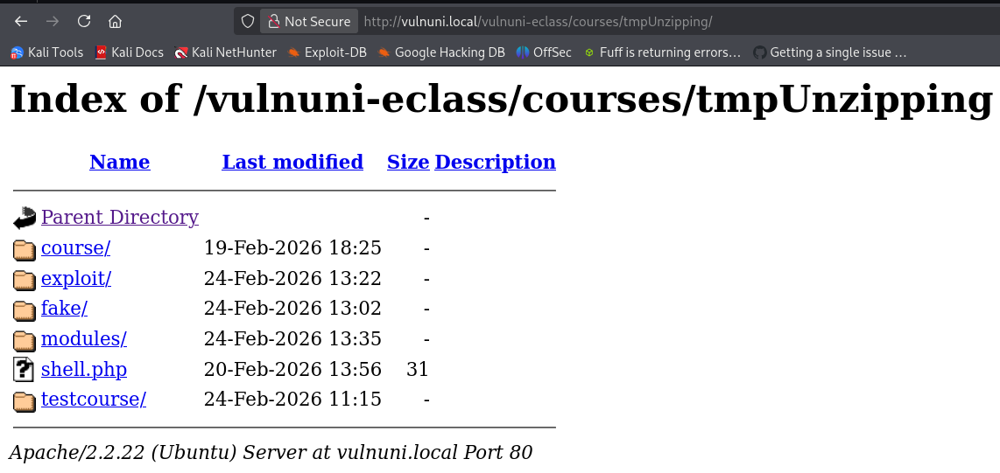

A command execution context was obtained as the www-data user.

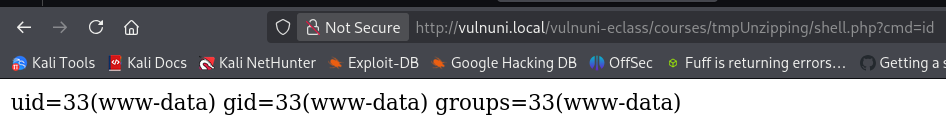

A reverse shell was then established.

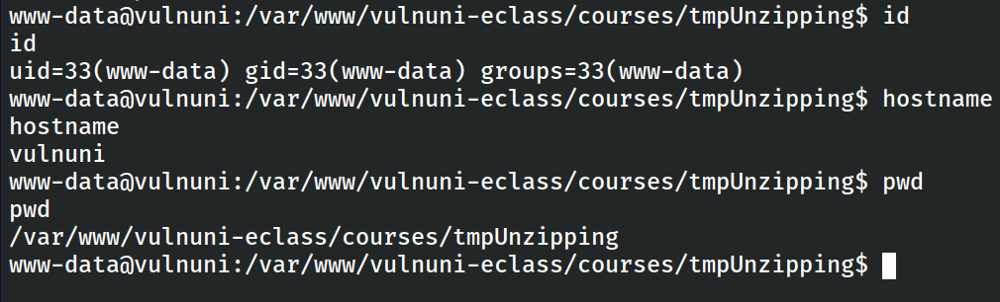

Evidence files:

evidence/docs/23_tmpUnzipping_listing.html  
evidence/docs/24_rce_output.txt

------------------------------------------------------------
User Access
------------------------------------------------------------

After gaining shell access, the user flag was obtained.

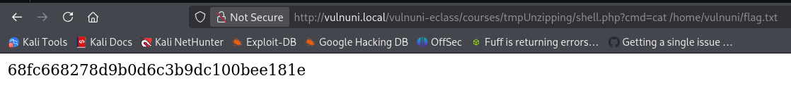

------------------------------------------------------------
Privilege Escalation – Dirty COW
------------------------------------------------------------

Local enumeration revealed the kernel version running on the target machine.

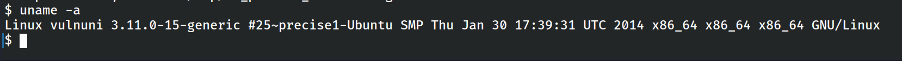

The system was vulnerable to the Dirty COW privilege escalation exploit.

The exploit was transferred to the target system.

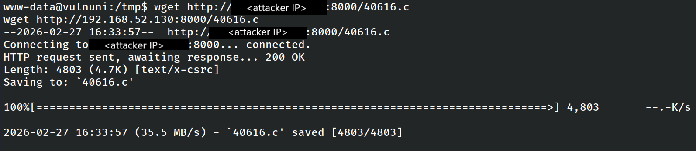

Compilation instructions were executed.

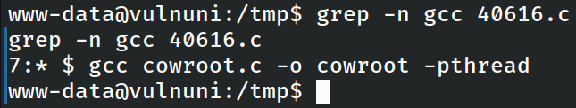

After running the exploit, a root shell was obtained.

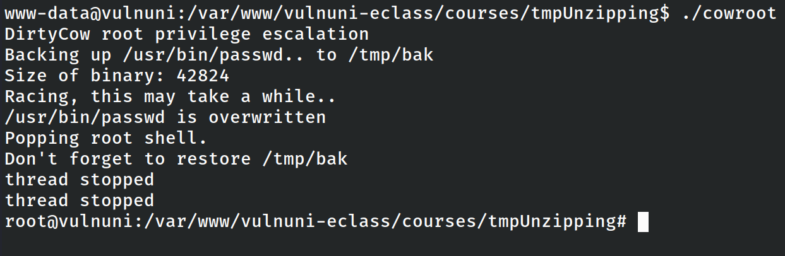

The final root flag confirmed full system compromise.

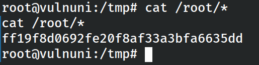

------------------------------------------------------------
Conclusion
------------------------------------------------------------

The VulnUni 1.0.1 machine demonstrates a realistic attack chain involving multiple common web application vulnerabilities.

Key weaknesses identified during this exercise include:

Insufficient input validation leading to SQL Injection  
Information disclosure through application errors  
Exposure of sensitive configuration data  
Improper file handling allowing remote code execution  
Outdated kernel vulnerable to Dirty COW privilege escalation

By chaining these vulnerabilities together, full root access to the system was successfully achieved.

This lab provided valuable practice in structured enumeration, exploitation, and evidence documentation during a complete penetration testing workflow.
